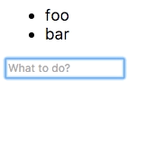

[demo-url]: https://rafaelrinaldi.github.io/data-components
[dist-url]: https://raw.githubusercontent.com/rafaelrinaldi/data-components/master/dist/index.min.js
[index]: https://github.com/rafaelrinaldi/data-components/blob/master/index.js
[manifest]: https://github.com/rafaelrinaldi/data-components/blob/master/package.json
[spa]: https://en.wikipedia.org/wiki/Single-page_application
[url]: http://rinaldi.io

# data-components

> Tiny component structure for web applications

## Install

```sh
$ npm install data-components --save
```

<sup>Or you can simply copy and paste the [minified standalone version that lives under `dist/`][dist-url]</sup>

## Features

* No need for a module bundler, it works in all browsers
* [Zero dependencies][manifest]
* No magic under the hood, [see it for yourself][index]
* Small (1.2 KB minified)

## Motivation

There are plenty of options to architect a web application out there but most of them often assume that you're working on a [SPA][spa]. That alone will add a lot of stuff that you might not want at all. Data binding, custom messaging system and virtual DOM to name a few.

Sometimes you just need something simple to kick things off without having to worry about naming conventions and programming paradigms. That's how this library was born.

## Usage

Let's implement the simplest todo list app.

```html
<!-- Create our todo list element passing some initial values -->
<ul data-component="todo" data-values="foo,bar"></ul>

<!-- Let's use a input field to read the user input -->
<input data-component="input" placeholder="What to do?">
```

Ok, now that we have our markup in place, let's implement the application.

```js
// Todo component
class Todo {
  constructor(el, options) {
    this.el = el;
    // Read from initial values
    this.todos = options.values.split(',');
    this.render();
  }

  // Add items to the list
  add(todo) {
    this.todos.push(todo);
    this.render();
  }

  // Render the list to the DOM
  render() {
    this.el.innerHTML = this.todos.map(todo => `<li>${todo}</li>`).join('');
  }
}

// User input component
class Input {
  constructor(el, options, sandbox) {
    const todo = sandbox.get('todo');

    // Submit value to "todo" component when hitting the enter key
    el.addEventListener('keydown', e => {
      if (e.keyCode === 13) {
        todo.add(el.value);
        el.value = '';
        el.focus();
      }
    });
  }
}

// Bootstrap components (UMD build exposes `components()`)
components({
  todo: Todo,
  input: Input
});
```



It works with just a few lines of code :tada:

[Check out the demo page][demo-url] for a slightly more complex example.

## More

For more detailed instructions on how the project works and how to use it, please [check the user guide](/GUIDE.md).

## License

MIT © [Rafael Rinaldi][url]

---

<p align="center">
  <a href="https://buymeacoff.ee/rinaldi" title="Buy me a coffee">Buy me a ☕</a>
</p>
